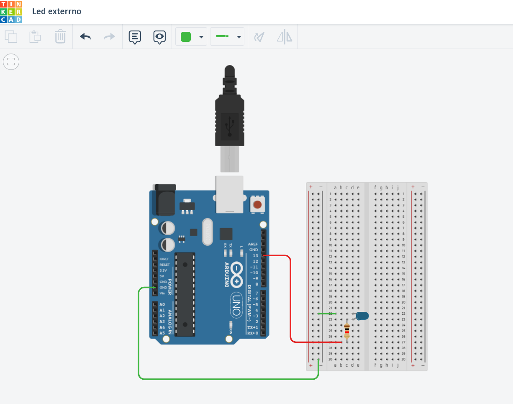

# Projetos Arduino

Este repositório contém o código desenvolvido para a atividade de Arduino.

## 📂 Estrutura do Projeto

- **/sketch** → pasta onde está localizado o código-fonte do Arduino (`.ino`).

## 🎥 Vídeos de Demonstração

**Confira os vídeos de funcionamento dos projetos no link abaixo:**

### 🔗 [Acesse o vídeo de demonstração (sketch_blink)](https://drive.google.com/file/d/1xztiShghJBF9ERknVL6_bu76WU7GSyaT/view?usp=drive_link)

### 🔗 [Acesse o vídeo de demonstração (sketch_led)](https://drive.google.com/file/d/1BvXS1HksF8Tl2_egUsxSp3PCjonstn_X/view?usp=drive_link)

## Modelagem no Tinkercad

### 🔗 [Acesse o projeto no Tinkercad](https://www.tinkercad.com/things/fYynwHc7mwx-led-exterrno?sharecode=JG2cXJOcK-7TtCZxRBYu7I6N7s2nR7Va9QZCFe67qaE)

