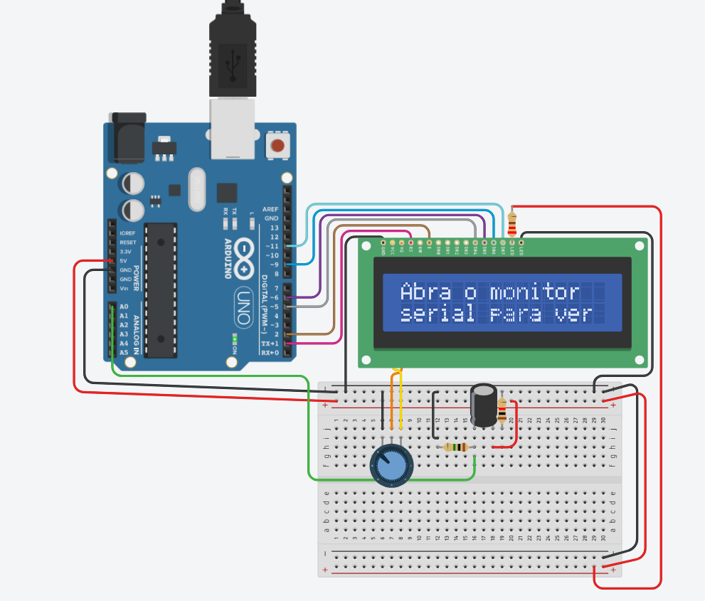
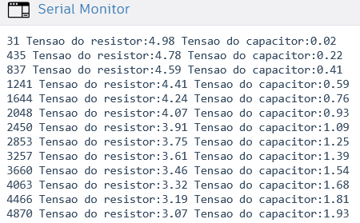
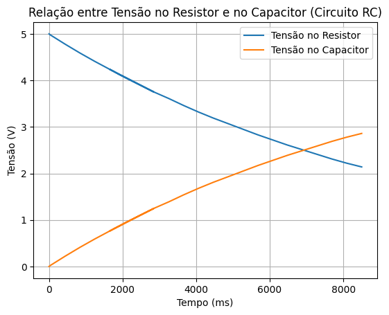

# Projetos Arduino

Este repositório contém o código desenvolvido para a atividade de Arduino referente a leitura de um sistema RC, .

## Protótipo físico

Abaixo está o protótipo físico desenvolvido no tinkercad



## Código desenvolvido

Abaixo é possível visualizar a código realizado para o funcionamento do sistema, nele foram configurados as leituras das resistências e uma placa LCD que instrui o usuário a abrir o monitor serial para visualizar a leitura dos valores das resistências

```C++ 
#include <LiquidCrystal.h>

int pinoNoRC=0; 
int valorLido = 0;
float tensaoCapacitor = 0, tensaoResistor;
unsigned long time; 
const int rs = 1, en = 2, d4 = 5, d5 = 6, d6 = 9, d7 = 11;
LiquidCrystal lcd(rs, en, d4, d5, d6, d7);

void setup(){ 
  lcd.begin(16, 2);

  lcd.setCursor(0, 0);
  lcd.print("Abra o monitor");
  
  lcd.setCursor(0, 1);
  lcd.print("serial para ver");
  
  Serial.begin(9600);
} 
void loop() { 
	time=millis(); 
	valorLido=analogRead(pinoNoRC); 
	tensaoResistor=(valorLido*5.0/1023); // 5.0V / 1023 degraus = 0.0048876 
	tensaoCapacitor = abs(5.0-tensaoResistor);
 	Serial.print(time); //imprime o conteúdo de time no MONITOR SERIAL
    Serial.print(" Tensao do resistor:"); 
  	Serial.print(tensaoResistor);
  	Serial.print(" Tensao do capacitor:");
  	Serial.println(tensaoCapacitor);
	delay(400);
}
```

## Outputs

Os outputs do sistema são apresentados da seguinte maneira no monitor serial



Para uma melhor visualização desses dados o gráfico a seguir representa a relção entre a tensão do resistor e a tensão do capacitor do sistema

