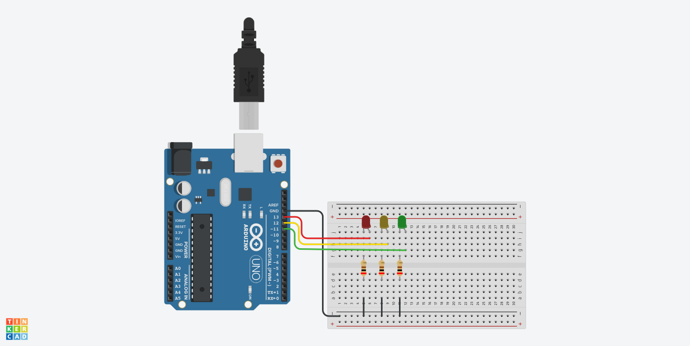

# Projetos Arduino

Este repositório contém o código desenvolvido para a atividade de Arduino utilizando programação OO.

## Protótipo físico

Abaixo está o protótipo físico desenvolvido no tinkercad



## Código desenvolvido

Abaixo é possível visualizar a código realizado para o funcionamento do sistema, nele foram configurado a classe de um Led e as funções para liga-lo e desliga-lo.

```C++ 
class Led {
  int port_;
public:
  Led(int port) {
    port_ = port;
    pinMode(port_, OUTPUT);
  }
  void On() {
    digitalWrite(port_, HIGH);
  }
  void Off() {
    digitalWrite(port_, LOW);
  }
};

Led vermelho(13);
Led amarelo(12);
Led verde(11);

void setup() {
}

void loop() {
    vermelho.Off();
  	amarelo.Off();
    verde.On();
  	delay(2000);
    vermelho.Off();
  	amarelo.On();
    verde.Off();
  	delay(1000);
  	vermelho.On();
  	amarelo.Off();
    verde.Off();
  	delay(2000);
}
```