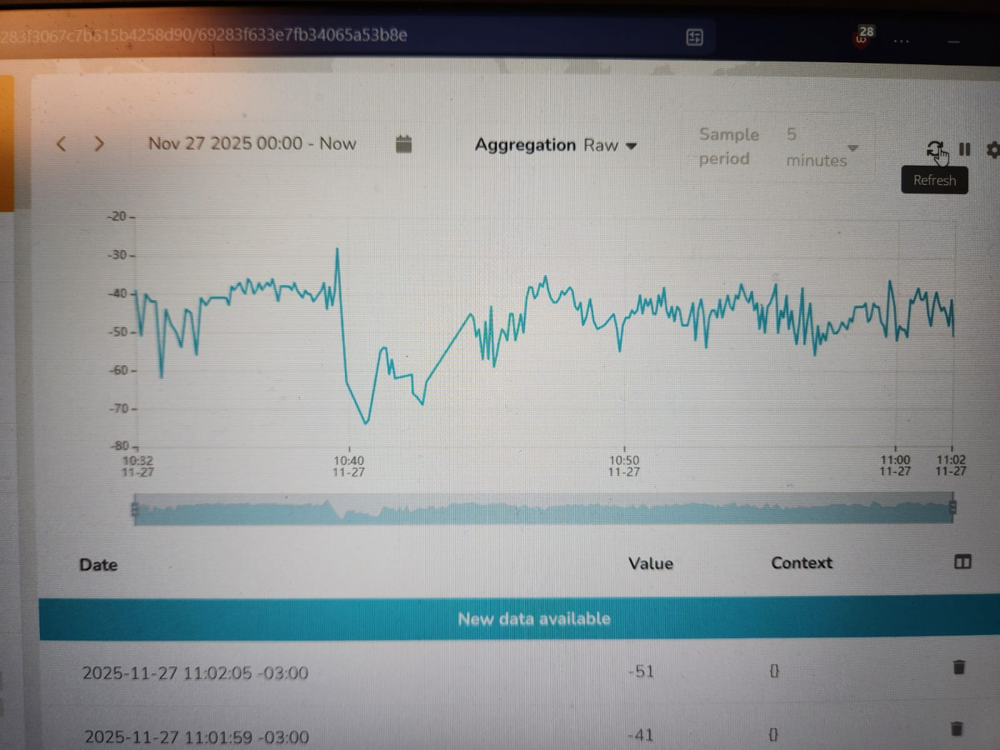

# 📡 Medição de Potência de Sinal WiFi com ESP32 e Envio para Plataforma IoT

## 1. Objetivo do Projeto

Este projeto tem como objetivo medir continuamente a potência do sinal WiFi (RSSI, em dBm) utilizando um microcontrolador ESP32 e enviar esses dados para uma plataforma IoT online. Além disso, uma dashboard foi configurada para exibir um gráfico contínuo (tempo × dBm), permitindo visualizar variações do sinal em diferentes cenários — incluindo o experimento de isolamento de sinal dentro do elevador do Inteli (simulação de uma gaiola de Faraday).

## 2. Arquitetura da Solução

O projeto envolve três componentes principais:

- ESP32 conectado à rede Inteli.Iot

- Coleta dos valores de RSSI (dBm) a cada 5 segundos

- Envio dos dados para a plataforma IoT Ubidots via requisições HTTP (POST)

## 3. Funcionamento Geral

O ESP32 executa os seguintes passos:

- Conecta-se à rede WiFi.

- A cada ciclo:

- Captura o valor do RSSI do sinal WiFi atual.

- Registra o tempo de execução (em segundos).

- Envia os dados para a plataforma Ubidots na forma de JSON.

- Imprime os valores também na porta Serial para monitoramento local.

- Esses dados alimentam um gráfico contínuo na dashboard, permitindo observar quedas de sinal e oscilações.

## 4. Cenários Testados

Foram realizados testes em ambientes com diferentes níveis de obstrução de sinal:

### 4.1 Ambiente aberto

- Sinal estável, mostrando pequenas oscilações naturais do WiFi.

### 4.2 Laboratórios e corredores do Inteli

- Pequenas variações devido a paredes e distância do roteador.

### 4.3 Elevador (Simulação de Gaiola de Faraday)

- Ao entrar no elevador o valor de RSSI cai drasticamente, pois as transmissões podem falhar devido ao bloqueio das paredes metálicas.

## 5. Dashboard na Ubidots

A dashboard foi configurada com os seguintes elementos:

📈 Gráfico de Linha (Tempo × dBm) atualizado em tempo real

🔢 Indicador do último valor recebido

🕒 Timeline de eventos de queda de sinal

O gráfico permite observar:

- Variações normais do RSSI ao longo do tempo

- Queda repentina ao entrar no elevador

- Recuperação após sair do ambiente isolado

## 6. Código Utilizado

A seguir, o código implementado no ESP32:
```cpp
#include <WiFi.h>
#include <HTTPClient.h>

// Dados da rede e da plataforma Ubidots
const char* ssid = "Inteli.Iot";
const char* password = "%(Yk(sxGMtvFEs.3";
const char* ubidotsToken = "BBUS-FM1QAFzQOnnxg5m2RLYipzmbr82Xyp";
const char* deviceLabel = "esp32"; // Nome do device na Ubidots

void initWiFi() {
  WiFi.mode(WIFI_STA);
  WiFi.begin(ssid, password);

  Serial.print("Connecting to WiFi ..");
  while (WiFi.status() != WL_CONNECTED) {
    Serial.print('.');
    delay(1000);
  }
  Serial.println(WiFi.localIP());
}

void setup() {
  Serial.begin(115200);
  initWiFi();
}

void loop() {
  if (WiFi.status() == WL_CONNECTED) {
    HTTPClient http;

    int signal = WiFi.RSSI(); // valor em dBm
    unsigned long tempo = millis() / 1000;

    String url = "http://industrial.api.ubidots.com/api/v1.6/devices/";
    url += deviceLabel;

    // Montagem do payload JSON
    String payload = "{\"signal\":";
    payload += signal;
    payload += ",\"tempo\":";
    payload += tempo;
    payload += "}";

    http.begin(url);
    http.addHeader("Content-Type", "application/json");
    http.addHeader("X-Auth-Token", ubidotsToken);

    int httpResponseCode = http.POST(payload);

    Serial.print("Payload enviado: ");
    Serial.println(payload);
    Serial.print("HTTP Response: ");
    Serial.println(httpResponseCode);

    http.end();
  } else {
    Serial.println("WiFi desconectado! Tentando reconectar...");
    initWiFi();
  }

  delay(5000); // envia a cada 5 segundos
}
```
## 7. Evidências

📎 [Acesse o vídeo de demonstração](https://drive.google.com/file/d/1v_stkvvyByalzPMgezdcrd0kWTGbEy_y/view?usp=drive_link)



## 8. Conclusão

Essa atividade permitiu a entender conceitos relacionados a como medir potencia de sinal WiFi usando ESP32, o envio dados para uma plataforma IoT a montagem de uma dashboard simples em tempo real e como fenômenos físicos, isolamento metálico, afetam a propagação de radiofrequência. Além disso, o experimento no elevador comprovou com clareza a queda súbita do RSSI quando o ESP32 é colocado dentro de um ambiente que simula uma gaiola de Faraday.