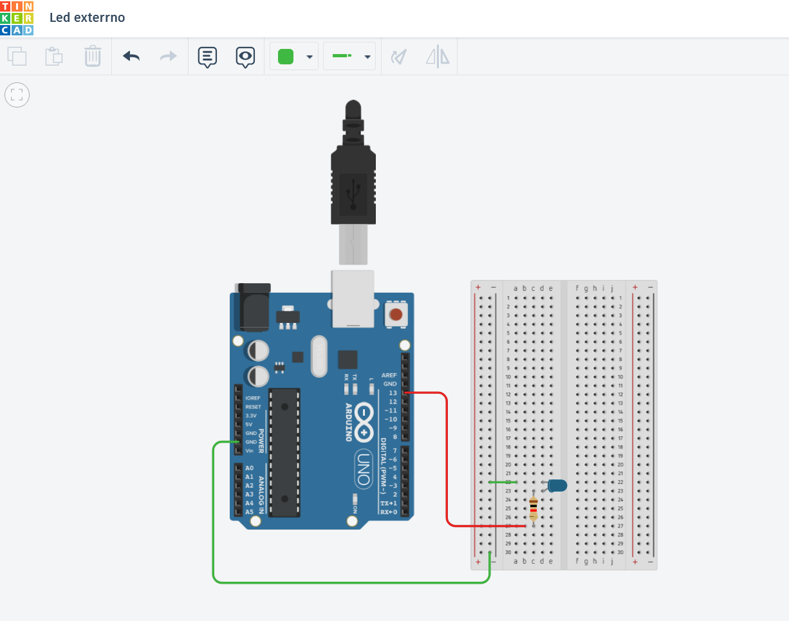

# Projeto Blink Arduino

Este repositório contém o código desenvolvido para a atividade de Arduino.

## 📂 Estrutura do Projeto

- **/sketch** → pasta onde está localizado o código-fonte do Arduino (`.ino`).

## 🎥 Vídeo de Demonstração

**Confira o vídeo de funcionamento do projeto no link abaixo:**

### 🔗 [Acesse o vídeo de demonstração (sketch_blink)](https://drive.google.com/file/d/1xztiShghJBF9ERknVL6_bu76WU7GSyaT/view?usp=drive_link)

### 🔗 [Acesse o vídeo de demonstração (sketch_led)](https://drive.google.com/file/d/1BvXS1HksF8Tl2_egUsxSp3PCjonstn_X/view?usp=drive_link)

## Modelagem no Tinkercad

### 🔗 [Acesse o projeto no Tinkercad](https://drive.google.com/file/d/1BvXS1HksF8Tl2_egUsxSp3PCjonstn_X/view?usp=drive_link)

